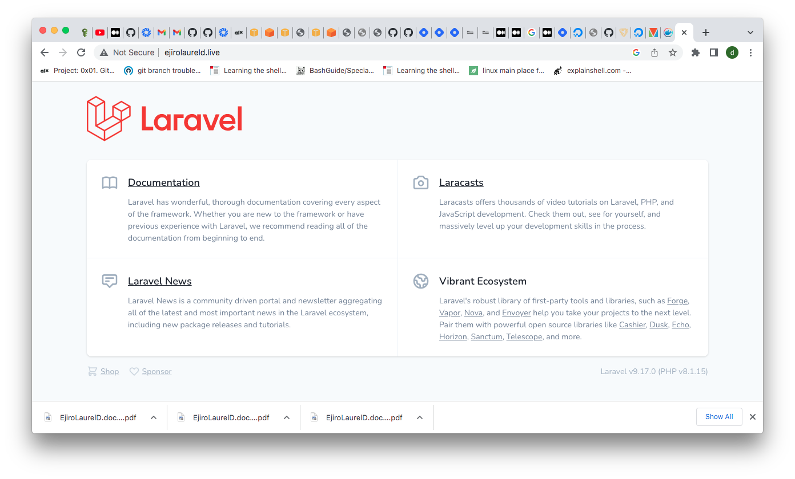
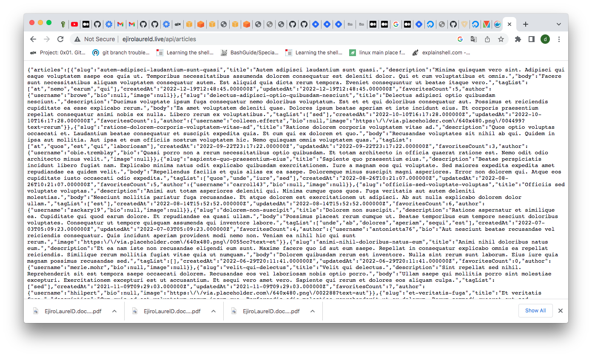

# deploy-laravel with docker.
I completed this project with the follwoing steps:

- I installed docker for Ubuntu using the convenient script here https://docs.docker.com/engine/install/ubuntu/
then installed docker compose with the commands below right after right after
`sudo apt-get update`
`sudo apt-get install docker-compose-plugin`
  
- Cloned the Laravel project repository from https://github.com/f1amy/laravel-realworld-example-app 
- I went on to edit the docker-compose file then created a docker folder in the app directory where I created Dockerfile and entrypoint.sh files.
- After editing the files  with the content in this current repository, I ran `docker-compose up -d` to build my images and create the containers.
- To confirm that the endpoints were working fine , I ran `docker exec -it php-container-id sh` (replace "php-container-id" with the name of your php container id)
and typed in the following commands in the container
   - `php artisan key:generate`
   - `php artisan migrate`
   - `php artisan config:cache`
   - `php artisan migrate:fresh`

I deployed the container on a digital ocean droplet and added assigned a domain to it http://ejirolaureld.live

